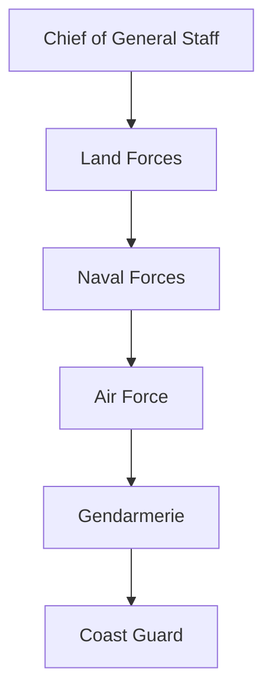

# Türkiye Military Forces

<div class="flex flex-col items-center justify-center">
  
  <span class="mt-6 text-xl">Strength · Modernization · Commitment</span>
</div>

<button class="slidev-icon-btn mt-10" @click="$slidev.nav.next">
  Begin Overview &nbsp;<carbon:arrow-right />
</button>

<!--
Welcome slide notes: Present the Turkish Armed Forces as a core pillar of defense, modernization, and national pride. Click to begin!
-->

---

layout: sidebar
sidebar:
  title: Table of Contents
  items:
    - Overview
    - Organization
    - Land Forces
    - Naval Forces
    - Air Force
    - Military Modernization
    - International Presence
    - Media Gallery
    - References

# Overview

Türkiye’s military is one of the largest and most robust armed forces in Europe and the Middle East.

- Founded: 1920s
- Active personnel: ~355,000
- Major components: Land, Naval, Air, Gendarmerie, Coast Guard

> "Peace at Home, Peace in the World." — Mustafa Kemal Atatürk

<div class="mt-5">
  
  <span>Learn more: <a href="https://www.tsk.tr/" target="_blank">Official TAF Site</a></span>
</div>

---

layout: two-cols
layoutClass: gap-16
---

# Organizational Structure

- **Land Forces Command**
- **Naval Forces Command**
- **Air Force Command**
- Gendarmerie General Command
- Coast Guard Command

::right::



---

layout: image-right
image: https://assets-global.website-files.com/5df008888c0c078b9fb2df24/60e5e8c7b5938b3dabdabf42_turklandforces.jpg
---

# Turkish Land Forces

- Size: ~260,000 active personnel
- Structure: 4 Field Armies, 13 Corps
- Focus: Territorial defense, border security, rapid deployment

Key Investments:

- Indigenous tanks (Altay)
- APCs & IFVs (Otokar, BMC)
- Modernization of infantry equipment

---

layout: image-left
image: https://upload.wikimedia.org/wikipedia/commons/5/55/TCG_Yildirim_%28F-243%29.jpg
---

# Turkish Naval Forces

- Modern Blue Water Navy
- Frigates, Corvettes, Submarines, Amphibious Vessels

Recent Advances:

- MILGEM (Indigenous corvette program)
- TCG Anadolu (LHD - Light Aircraft Carrier)

```markdown

```

---

layout: image-right
image: https://www.airforce-technology.com/wp-content/uploads/sites/27/2020/09/shutterstock_1097417776.jpg
---

# Turkish Air Force

- Personnel: ~60,000
- Fleet: F-16, F-4, UAVs (Bayraktar TB2, Anka)
- Key Focus: Air defense, power projection, unmanned systems

<div class="mt-5">
  <iframe width="420" height="235" src="https://www.youtube.com/embed/m0v4eFyG5X0?start=28" title="Turkish Air Force in Action" frameborder="0" allowfullscreen></iframe>
</div>

---

layout: two-cols
---

# Military Modernization

- National modernization agenda: indigenous tech focus
- Drone leadership: Bayraktar TB2, Akıncı, Anka
- ISTAR & EW enhancements
- Frigate/corvette shipbuilding
- Armored vehicle digitization

::right::

```html
<ul>
  <li>Investment in R&D</li>
  <li>Joint projects with allies (e.g., Fırtına howitzers)</li>
  <li>Export partnerships: Defense industry boom</li>
</ul>
```

---

layout: image-center
image: https://www.savunmasanayist.com/wp-content/uploads/2020/08/bayraktartb2-1.jpg
---

# International Presence & Peacekeeping

- Key NATO member since 1952
- International operations: Kosovo, Afghanistan, Somalia, Libya, Syria
- Major role in humanitarian & disaster relief missions

<div>
  
</div>

---

layout: center
class: "bg-[#2B90B6] text-white"
---

# Media Gallery

::gallery::


::endgallery::

<div class="mt-5">
  <iframe width="420" height="235" src="https://www.youtube.com/embed/Qvk1SAwPgK0" title="Bayraktar TB2 promotional video" frameborder="0" allowfullscreen></iframe>
</div>

---

layout: two-cols
---

# Build Your Knowledge

- All slides are interactive: click highlights, images zoom on hover
- Presenter Mode: <kbd>P</kbd> to show notes, audience view, timer
- Use markdown, code blocks, diagrams, live-vue
- Try the navigation sidebar & responsive layout

::right::

<Toc maxDepth="2" />

---

layout: center
class: text-center
---

# References

- [Turkish Armed Forces (Official)](https://www.tsk.tr/)
- [Global Firepower: Turkey](https://www.globalfirepower.com/country-military-strength-detail.php?country_id=turkey)
- [Ministry of National Defence](https://www.msb.gov.tr/)
- [Jane’s Defence Weekly](https://www.janes.com/defence-news)

<div class="mt-4">
  <span class="text-xs text-gray-400">Created with <a href="https://sli.dev/" class="underline">Slidev</a> | Turkish Military Force Interactive Overview</span>
</div>

---

layout: center
class: "bg-[#f9cf02] text-black"
---

# Thank You!

<div class="mb-6">
  <span class="text-xl font-bold">Questions?</span>
</div>


<div class="mt-8 text-base">
  <span>Press <kbd>P</kbd> for Presenter Mode | <kbd>H</kbd> for Navigation Help</span>
</div>

---

<!-- Presenter Notes and Support (for Presenter Mode) -->
Note:
  - Use presenter mode for detailed talking points.
  - Highlight interactive features and modern media integration.
  - For live demo: show navigation bar, sidebar, image zoom, and embedded videos.
